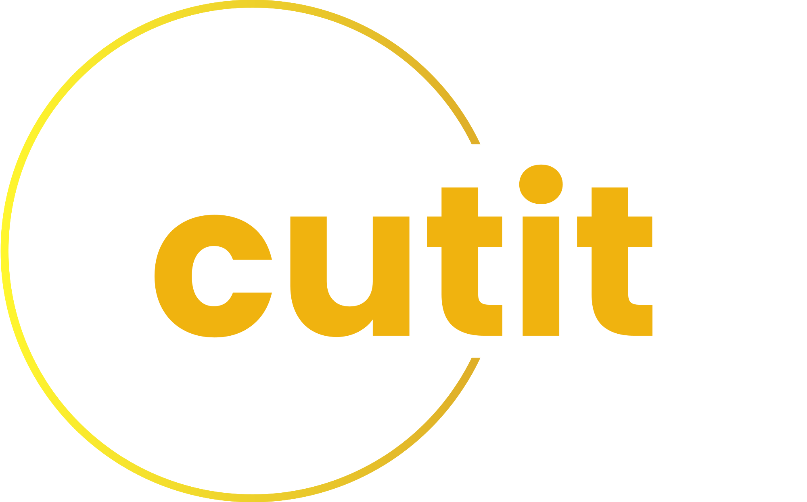

# JessiScissor
<!-- Back to Top Navigation Anchor -->
<a name="readme-top"></a>

<!-- Project Shields -->
<div align="center">

  [![Contributors][contributors-shield]][contributors-url]
  [![Forks][forks-shield]][forks-url]
  [![Stargazers][stars-shield]][stars-url]
  [![Issues][issues-shield]][issues-url]
  [![MIT License][license-shield]][license-url]
  [![Twitter][twitter-shield]][twitter-url]
</div>

<!-- Project Logo -->
<br />
<div align="center">
  <a href="https://sciz.site">
    
  </a>
</div>

<br />

<div>
  <p align="center">
    <a href="https://github.com/Jessica-ovabor/scissor/wiki"><strong>Explore the docs »</strong></a>
    <br />
    <br />
    <a href="#sample">View Demo</a>
    ·
    <a href="https://github.com/Jessica-ovabor/JessiScissor/issues">Report Bug</a>
    ·
    <a href="https://github.com/Jessica-ovabor/JessiScissor/issues">Request Feature</a>
  </p>
</div>

---

<!-- Table of Contents -->
<details>
  <summary>Table of Contents</summary>
  <ol>
    <li>
      <a href="#about-JessiScissor">About Scissor</a>
      <ul>
        <li><a href="#built-with">Built With</a></li>
      </ul>
    </li>
    <li>
      <a href="#lessons-learned">Lessons Learned</a>
    </li>
    <li>
      <a href="#usage">Usage</a>
      <ul>
        <li><a href="#live-link">Live Link</a></li>
        <li>
          <a href="#localhost">Localhost</a>
          <ul>
            <li><a href="#prerequisites">Prerequisites</a></li>
            <li><a href="#installation">Installation</a></li>
          </ul>
        </li>
      </ul>
    </li>    
    <li><a href="#sample">Sample</a></li>
    <li><a href="#license">License</a></li>
    <li><a href="#contact">Contact</a></li>
    <li><a href="#acknowledgements">Acknowledgements</a></li>
  </ol>
  <p align="right"><a href="#readme-top">back to top</a></p>
</details>

---

<!-- About the Tool -->
## About Cutit


Cutit as the name implies is a url shortener shortener tool that combine the literal meaning of `cut` to remove or clear in the case of this project it removes long url and  `it`represent a the action taken after it has been shorten.

it is a simple tool which makes URLs as short as possible, as "brief is the new oil" in the age of social media.

Cutit converts long URLs into easily sharable QR codes and short, customizable links.

Cutit is looking forward to shortening links with no payment attached

<p align="right"><a href="#readme-top">back to top</a></p>

### Built With:

![Python][python]
![Flask][flask]
![Jinja][jinja]
![HTML5][html5]
![CSS3][css3]


![SQLite][sqlite]


<p align="right"><a href="#readme-top">back to top</a></p>

---
<!-- Lessons from the Project -->
## Lessons Learned

Creating this tool helped to learn and practice:
* Responsive Web Design with HTML ,CSS  and Bootstrap
* Caching
* Limiting of request to prevent DOS attacks
* URL Shortening
* QR Code Generation
* Debugging
* Routing
* Database Management
* Internet Security
* User Authentication
* User Authorization
* Message Flashing
* Documentation
* Deployment using render.com

<p align="right"><a href="#readme-top">back to top</a></p>

---

<!-- Getting Started -->
## Usage

This tool can be accessed via the deployed site or a local copy of the project.

### Live Link

Deployed site: [sciz.site](https://www.sciz.site) - hosted via [namecheap](https://www.namecheap.com) 

### Localhost

To get a local copy up and running, follow the steps below.

#### Prerequisites

Python3: [Get Python](https://www.python.org/downloads/)

#### Installation

1. Clone this repo
   ```sh
   git clone https://github.com/Jessica-ovabor/Jessiscissor.git
   ```
2. Activate the virtual environment
   ```sh
   env  JessiScissor/Scripts/Activate
   ```
3. Install project packages
   ```sh
   pip install -r requirement.txt
   ```
4. Run Flask
   ```sh
   flask run
   ```
5. Open the link generated in the terminal on a browser  

<p align="right"><a href="#readme-top">back to top</a></p>

---

<!-- Sample Screenshot -->
## Sample

<br />


<br/>


<br/>

<p align="right"><a href="#readme-top">back to top</a></p>

---

<!-- License -->
## License

Distributed under the MIT License. See <a href="https://github.com/Ze-Austin/scissor/blob/main/LICENSE">LICENSE</a> for more information.

<p align="right"><a href="#readme-top">back to top</a></p>

---

<!-- Contact -->
## Contact

Jessica ovabor - [@jovabor](https://twitter.com/Jessica-ovabor) - ovaborjessica85@gmail.com

Project Link: [JessiScissor](https://github.com/Jessica-ovabor/JessiScissor)

Live Link: [sciz.site](https://www.sciz.site)

<p align="right"><a href="#readme-top">back to top</a></p>

---

<!-- Acknowledgements -->
## Acknowledgements

This project was made possible by:

* [My AltSchool Python Repo](https://github.com/Ze-Austin/altschool-python)
* [GitHub Student Pack](https://education.github.com/globalcampus/student)
* [Othneil Drew's README Template](https://github.com/othneildrew/Best-README-Template)
* [Ileriayo's Markdown Badges](https://github.com/Ileriayo/markdown-badges)
* [Stack Overflow](https://stackoverflow.com/)

<p align="right"><a href="#readme-top">back to top</a></p>

---

<!-- Markdown Links & Images -->
[contributors-shield]: https://img.shields.io/github/contributors/Jessica-ovabor/JessiScissor.svg?style=for-the-badge
[contributors-url]: https://github.com/Jessica-ovabor/JessiScissor/graphs/contributors
[forks-shield]: https://img.shields.io/github/forks/Jessica-ovabor/JessiScissor.svg?style=for-the-badge
[forks-url]: https://github.com/Jessica-ovabor/JessiScissor/network/members
[stars-shield]: https://img.shields.io/github/stars/Jessica-ovabor/cJessiScissor.svg?style=for-the-badge
[stars-url]: https://github.com/Jessica-ovabor/JessiScissor/stargazers
[issues-shield]: https://img.shields.io/github/issues/Jessica-ovabor/JessiScissor.svg?style=for-the-badge
[issues-url]: https://github.com/Jessica-ovabor/JessiScissor/issues
[license-shield]: https://img.shields.io/github/license/Jesssica-ovabor/JessiScissor.svg?style=for-the-badge
[license-url]: https://github.com/Jessica-ovabor/JessiScissor/blob/main/LICENSE.txt
[twitter-shield]: https://img.shields.io/badge/-@jovabor-1ca0f1?style=for-the-badge&logo=twitter&logoColor=white&link=https://twitter.com/jovabor
[twitter-url]: https://twitter.com/jovabor
[python]: https://img.shields.io/badge/python-3670A0?style=for-the-badge&logo=python&logoColor=ffdd54
[flask]: https://img.shields.io/badge/flask-%23000.svg?style=for-the-badge&logo=flask&logoColor=white
[jinja]: https://img.shields.io/badge/jinja-white.svg?style=for-the-badge&logo=jinja&logoColor=black
[html5]: https://img.shields.io/badge/html5-%23E34F26.svg?style=for-the-badge&logo=html5&logoColor=white
[css3]: https://img.shields.io/badge/css3-%231572B6.svg?style=for-the-badge&logo=css3&logoColor=white
[sqlite]: https://img.shields.io/badge/sqlite-%2307405e.svg?style=for-the-badge&logo=sqlite&logoColor=white

